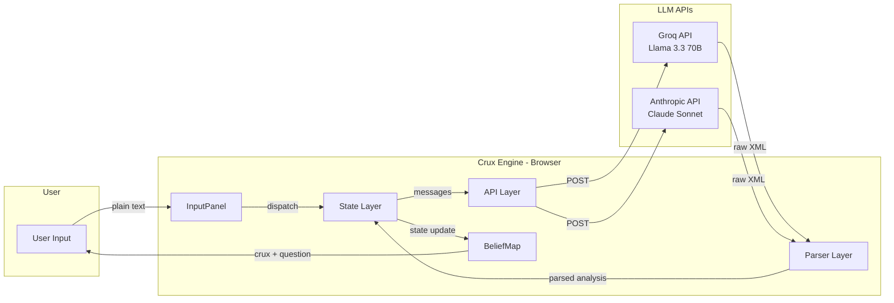
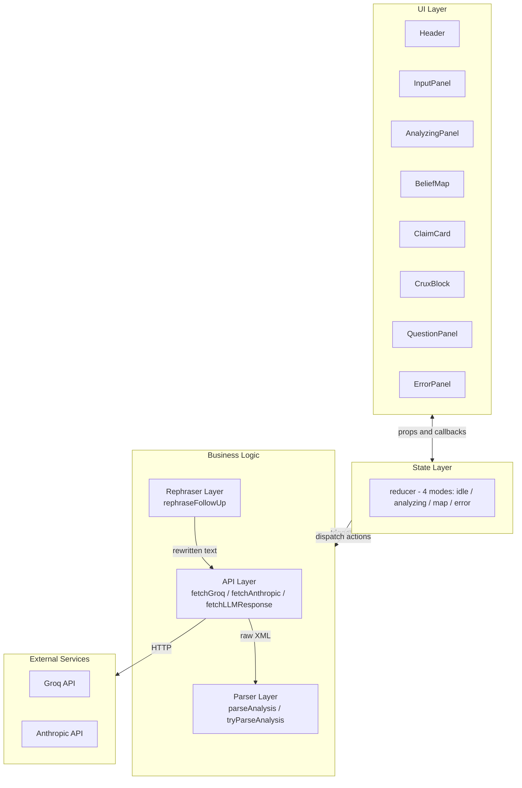
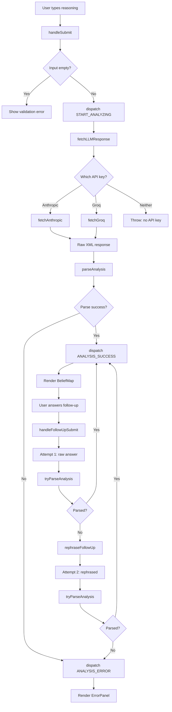
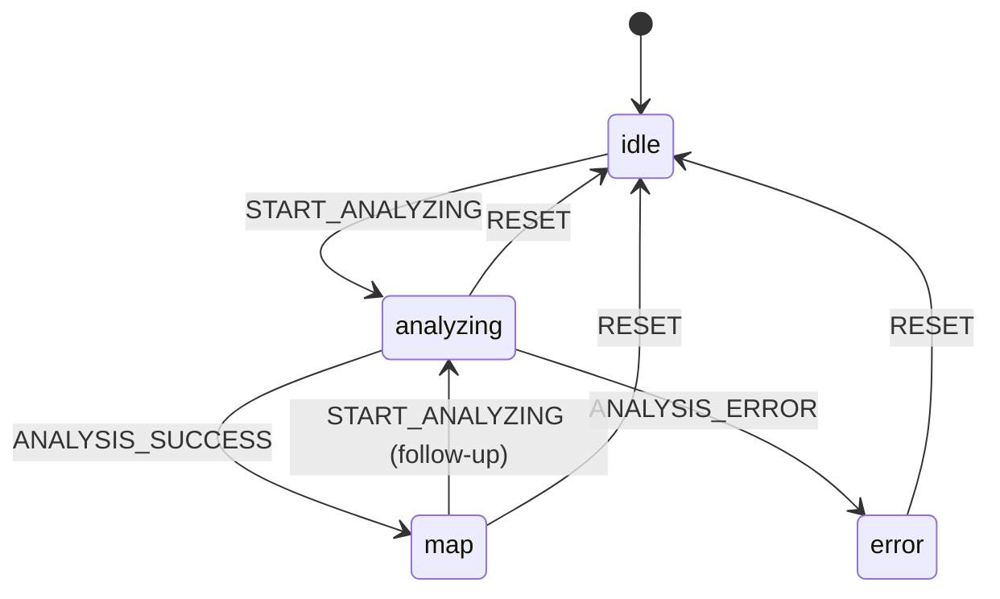
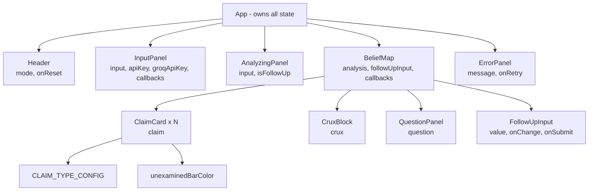
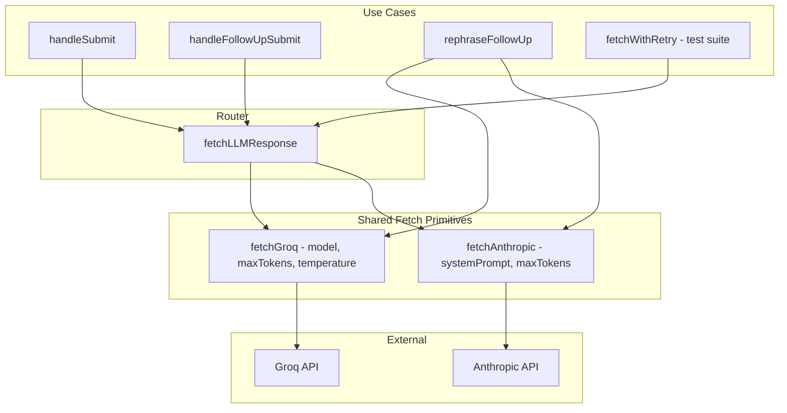

# Crux Engine

> Find what your reasoning actually depends on — before you commit.

## What It Does

People make big decisions — quitting a job, taking a bond, moving cities — based on reasoning that sounds solid in their head but has never been stress-tested. The problem is not that people think badly. The problem is that the weakest link in their reasoning is usually the one they never notice: an assumption so natural to them that it feels like a fact.

Crux Engine takes a decision or belief written in plain language and decomposes it into its epistemic components. Every claim in your reasoning gets classified as a **FACT** (verified), **INFERENCE** (concluded), **PRIOR** (assumed), or **VIBE** (felt). The app then identifies the **crux** — the single assumption that is both most load-bearing and least examined — and produces one sharp question designed to surface what you have not considered.

For example, if you type *"I should accept this job offer — the salary is 2x my current pay and I can handle a 3-year bond,"* the engine might surface that your real crux is the untested assumption "I can handle a 3-year bond" and ask: *"Have you ever stayed at a job you disliked for more than 18 months, and what happened to your performance?"*

---

## Why This Exists

Every reasoning tool today either gives you a static framework (pros/cons lists, decision matrices) or a general-purpose chatbot that mirrors your reasoning back at you. Static tools cannot parse natural language. General chatbots are agreeable by default — they validate rather than probe. Neither finds the load-bearing assumption you have not examined.

Crux Engine fills that gap with a constrained AI system. The system prompt forces the model into an adversarial-epistemic posture: classify, locate the weakest structural point, and produce exactly one question. It is not a chatbot. It does not give advice. It does not agree with you. It finds the thing your decision depends on that you have not verified — and makes you look at it.

---

## Live Demo

Local only. See [Local Setup](#local-setup) to run it.

---

## How To Use It

### Step 1 — State your decision or belief

Type your reasoning into the text area as you would explain it to a friend. Messy is fine. Example: *"I have a job offer with a 3-year bond at 5 LPA. I want to do M.Tech from IIT but I'm not sure if I'm smart enough. I think research is what I really want to do."*

### Step 2 — Read your belief map

The engine breaks your reasoning into 3–7 claims, each tagged with a type and an "unexamined" score (0–100). Higher scores mean you asserted the claim without evidence. The visual bar shows how examined each piece of your reasoning actually is.

### Step 3 — Find your crux

Below the belief map, a highlighted block shows **The Crux** — the single assumption your entire conclusion rests on. It explains what breaks if this assumption is wrong. This is not the most important claim. It is the most important *unexamined* claim.

### Step 4 — Answer the question

The engine asks one question. Type your honest answer and hit "Update analysis." The engine re-analyzes your full reasoning — including your new response — and produces an updated belief map with a new crux. This loop continues until you have examined what matters.

---

## Claim Types Explained

| Type | What It Means | Example |
|------|--------------|---------|
| FACT | Something verifiable you actually know | "I have a job offer at 5 LPA with a 3-year bond" |
| INFERENCE | A conclusion drawn from other beliefs | "Therefore the bond means I cannot pursue M.Tech for 3 years" |
| PRIOR | A background assumption brought in silently | "I'm not smart enough for IIT" |
| VIBE | A feeling or intuition dressed as a reason | "Research is what I really want to do" |

---

## Architecture

### Tech Stack

| Technology | Why |
|---|---|
| **React 19** | Component model for reactive state-driven UI without page reloads |
| **Vite 8** | Sub-second HMR and fast cold starts for single-file development |
| **Tailwind CSS 4** | Utility-first styling with custom design tokens for the dark theme |
| **Groq API** | Free-tier access to Llama 3.3 70B with low latency inference |
| **Anthropic API** | Optional Claude Sonnet support for higher-quality analysis |
| **Inter (Google Fonts)** | Clean, modern typeface optimized for long-form reading |

### System Overview



### Application Structure

The entire app lives in a single file (`App.jsx`) organized into five strict layers:

- **API Layer** — Two shared fetch primitives (`fetchGroq`, `fetchAnthropic`) that handle all HTTP communication. A router function (`fetchLLMResponse`) picks the right API based on which key is provided. No other layer touches the network.
- **Parser Layer** — Regex-based XML extraction (`parseAnalysis`) that handles clean output, markdown-fenced output, truncated output, and malformed tags. Three helper functions (`extractTag`, `extractTagGreedy`, `extractAllTags`) provide exact-match and greedy fallback extraction.
- **Rephraser Layer** — A single function (`rephraseFollowUp`) that rewrites user follow-up answers into clear structured prose before re-submitting to the analysis model. Uses a separate system prompt with lower temperature.
- **State Layer** — A `useReducer`-based state machine with four modes (`idle`, `analyzing`, `map`, `error`). All transitions are handled through dispatched actions. No state mutation happens outside the reducer.
- **UI Layer** — Seven presentational components (`Header`, `InputPanel`, `AnalyzingPanel`, `ClaimCard`, `CruxBlock`, `QuestionPanel`, `BeliefMap`, `ErrorPanel`) that receive data and callbacks only. No component contains API logic.



### Data Flow

1. User types reasoning into `InputPanel` and clicks "Find the crux"
2. `handleSubmit` validates input, dispatches `START_ANALYZING`, calls `fetchLLMResponse`
3. `fetchLLMResponse` routes to `fetchGroq` or `fetchAnthropic` based on available API key
4. Raw XML response is passed to `parseAnalysis`, which extracts claims, crux, and question
5. Parsed data is dispatched via `ANALYSIS_SUCCESS`, triggering `BeliefMap` render
6. User answers the follow-up question, triggering `handleFollowUpSubmit`
7. **Attempt 1:** Raw answer is appended to conversation history and sent for re-analysis
8. If parsing succeeds → updated belief map rendered
9. **Attempt 2 (fallback):** If parsing fails, `rephraseFollowUp` rewrites the answer, then re-submits
10. If both attempts fail → `ANALYSIS_ERROR` dispatched, `ErrorPanel` rendered



### State Machine



### Key Design Decisions

**Regex over DOMParser.** LLM output is structurally XML but frequently malformed — missing closing tags, stray prose around the XML block, markdown fences wrapping the output. A DOMParser would reject all of these. The regex parser with greedy fallbacks handles every observed failure mode from Llama 3.3 and Claude.

**XML over JSON.** JSON from LLMs suffers from unescaped quotes, trailing commas, and inconsistent key names. XML with simple tags produces more reliable output because the model treats tags as structural delimiters, not as content to escape.

**No backend.** API keys stay in browser memory and are sent directly to Groq or Anthropic. This eliminates deployment complexity and avoids storing user reasoning on any server. The tradeoff is that CORS must be handled by the API provider.

**One question, not many.** Language models default to producing lists. Forcing exactly one question requires explicit prompt constraints and produces a sharper result. A list of five questions lets the user pick the easiest one to answer. One question removes that escape route.

**Single-file architecture.** With ~1,100 lines and five clearly separated layers, the codebase is readable as one scroll. Splitting into multiple files would add import boilerplate and navigation overhead without meaningful benefit at this scale.

---

## AI Design

### System Prompt Strategy

The system prompt uses three constraint layers. First, it defines the four epistemic types with precise definitions that prevent the model from conflating categories (e.g., PRIOR vs INFERENCE). Second, it defines the crux as both "most load-bearing" AND "least examined" — a dual constraint that prevents the model from simply picking the most dramatic claim. Third, it enforces XML-only output with an exact schema, which eliminates conversational preamble and makes parsing deterministic. The "never add prose outside the XML tags" rule exists because every tested model — including Llama 3.3 and Claude — will add "Here's my analysis:" if not explicitly told not to.

### The Rephrase Fallback

When a follow-up answer fails to parse on the first attempt, the engine silently rewrites the user's answer using a separate rephraser prompt (lower temperature, different system instruction). The rephraser removes filler words, structures the response into clear first-person prose, and preserves all substantive points. This works because parse failures on follow-ups are almost always caused by vague or rambling user input that confuses the model's XML generation — not by model incapability. A simple retry with the same input would fail identically. Rephrasing changes the input just enough to produce parseable output.

### Why One Question

Producing exactly one question is harder than producing five. LLMs are trained on text where lists are natural and single items feel incomplete. The system prompt uses three reinforcing constraints: "produce exactly ONE question," "not a list," and "never produce more than one question." Without all three, Llama 3.3 produces numbered lists approximately 20% of the time. The single-question constraint is the core UX decision — it forces the model to prioritize, and it forces the user to sit with the hardest question instead of deflecting to an easier one.

---

## Local Setup

### Prerequisites

- Node.js 18+ and npm
- A Groq API key (free at [console.groq.com/keys](https://console.groq.com/keys)) or an Anthropic API key

### Installation

```bash
git clone https://github.com/icemberg/Crux_Engine.git
cd Crux_Engine
npm install
npm run dev
```

Open `http://localhost:5173` in your browser. Enter your API key in the key section on the page — keys are stored in memory only and never persisted.

### Running Tests

The test suite runs in the browser console. In development mode, click the **⚡ Run test suite** button in the app footer. This executes three test layers sequentially:

```
Layer 1: Parser stress tests (9 cases, instant)
Layer 2: Model consistency tests (5 prompts × 3 runs, ~3 minutes with rate limiting)
Layer 3: Crux quality tests (3 cases, requires human review)
```

---

## Testing

### Layer 1 — Parser Tests

Nine test cases covering clean XML, markdown-fenced XML, prose-wrapped XML, special characters, missing tags, empty input, and non-XML input. Parser must correctly extract data from valid inputs and throw on invalid ones. **Passing: 9/9.**

### Layer 2 — Consistency Tests

Five real-world reasoning prompts, each sent to the model three times. Every response must parse successfully. The threshold is 90% — if more than 10% of valid (non-rate-limited) runs fail to parse, the system prompt needs strengthening. Tests include 12-second delays between calls for Groq free-tier rate limits.

### Layer 3 — Crux Quality Tests

Three curated inputs with expected crux keywords. The engine's identified crux is compared against human-expected keywords, and a match percentage is reported. This layer cannot be automated — it requires human judgment on whether the model found the *real* crux, not just a plausible one.

---

## Project Structure

```
src/App.jsx            ← entire application (single file)
  ├─ Constants         ← GROQ_API_URL, APP_MODE, CLAIM_TYPE_CONFIG, etc.
  ├─ System Prompts    ← SYSTEM_PROMPT, REPHRASE_SYSTEM
  ├─ Parser Layer      ← parseAnalysis, tryParseAnalysis, extractTag*
  ├─ Test Suite        ← parserTestCases, runConsistencyTests, runCruxQualityTests
  ├─ State Layer       ← initialState, reducer (useReducer)
  ├─ API Layer         ← fetchGroq, fetchAnthropic, fetchLLMResponse
  ├─ Rephraser Layer   ← rephraseFollowUp
  ├─ UI Components     ← Header, InputPanel, AnalyzingPanel, ClaimCard,
  │                       CruxBlock, QuestionPanel, BeliefMap, ErrorPanel
  └─ App (root)        ← handleSubmit, handleFollowUpSubmit, handleReset

src/index.css          ← Tailwind config, custom animations, design tokens
src/main.jsx           ← React entry point
index.html             ← HTML shell with Inter font and meta tags
```

### Component Tree



### API Routing — DRY Fetch Architecture



---

## Known Limitations

- **Short inputs produce weak analysis.** Inputs under 20 words often lack enough claims for meaningful decomposition. The model fills gaps with inferred claims that the user did not actually state, which weakens the crux identification.
- **English only.** The system prompt and parser are designed for English. Other languages may produce partial parses or misclassified claim types because the epistemic type definitions are English-specific.
- **Model variance on ambiguous reasoning.** When the user's reasoning is genuinely ambiguous (multiple plausible cruxes), different runs can produce different cruxes. The consistency test suite catches this at the parse level but cannot verify semantic stability.
- **No conversation persistence.** Refreshing the page loses the entire analysis. There is no local storage, export, or share functionality.
- **Rate limiting on free tier.** Groq's free tier allows ~30 requests per minute. Follow-up flows that trigger rephrase retries use 3 API calls per attempt, which can hit rate limits during rapid use.

---

## What Was Left Out Deliberately

- **Multi-turn memory across sessions** — adds storage complexity and privacy concerns for a tool designed to be ephemeral.
- **Confidence scores on the crux** — the model cannot reliably self-assess the quality of its own crux identification; showing a fake confidence number would mislead users.
- **Multiple question generation** — weakens the UX by letting users dodge the hardest question; the one-question constraint is the core design.
- **User accounts and history** — the app processes personal reasoning; storing that data creates liability without proportional benefit.
- **Streaming responses** — adds complexity to the parser (partial XML is unparseable) for a marginal UX improvement on a 2–4 second response time.

---

## Future Improvements

- **Belief map diffing** — visually highlight what changed between follow-up rounds so the user can see how their answer shifted the analysis.
- **Export to markdown** — let users save their full analysis chain as a portable document for later reflection.
- **Claim provenance linking** — connect each extracted claim back to the exact phrase in the user's input, making the decomposition auditable.
- **Offline mode with local models** — integrate WebLLM or a local Ollama endpoint so the tool works without any API key or network access.
- **Input scaffolding for short prompts** — when the input is too short, prompt the user with targeted questions to expand their reasoning before analysis.

---

## Build Challenge Notes

### The Problem Choice

Most AI tools built for hackathons optimize for generation — write my email, generate my code, create my image. Crux Engine optimizes for *examination*. The bet is that the harder and more valuable AI application is not one that produces content for you, but one that finds the thing you have not thought about. Epistemic decomposition is a real technique used in forecasting and rationality communities, but it has never been packaged as a consumer tool. This felt like the right gap.

### The Scope Decision

The smallest interesting version of this idea is: paste your reasoning, get a belief map and one question, answer the question, get an updated map. That is exactly what was built. No accounts, no history, no collaboration, no export. Every feature that was cut was cut because it does not make the core loop better — it makes the app bigger. The rephrase fallback was the one addition beyond the minimum, and it was added because follow-up failures were breaking the core loop in testing.

### What Would Make This Better

The weakest part of the current version is crux stability. On ambiguous inputs, the model identifies different cruxes across runs. This is not a prompt engineering problem — it is a fundamental property of sampling-based generation. The right fix is majority-vote crux selection across 3 parallel API calls, but that triples cost and latency. A production version would need either a fine-tuned model with lower crux variance or a consensus mechanism that is transparent to the user.

---

## License

MIT


